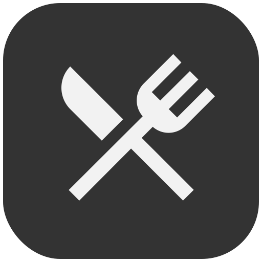

  <p align="center">
  <a href="https://github.com/mzeroes/minze">
    
  </a>
  </p>
  <h2 align="center" style="font-family: monospace">Minze</h2>
  <p>
  <div align="center" >
  <a href="https://github.com/shubhamxy/minze/actions">
  
  </a>
  &nbsp;&nbsp;&nbsp;&nbsp;&nbsp;
  &nbsp;&nbsp;
  <a href="https://install.appcenter.ms/users/mzeroes/apps/minze-2/distribution_groups/public%20preview">
  
  </a>&nbsp;&nbsp;&nbsp;&nbsp;&nbsp;
  &nbsp;&nbsp;
    <a href="https://install.appcenter.ms/users/mzeroes/apps/minze-1/distribution_groups/public%20preview">
  
  </a>
</p>
</div>

---

Order Food, drinks and groceries from your favorite places & track on the go, with the Minze app.

## Features

- Easy to use.
- Safe & light weight.

## Android : [download](https://install.appcenter.ms/users/mzeroes/apps/minze-2/distribution_groups/public%20preview)

## IOS : [download](https://install.appcenter.ms/users/mzeroes/apps/minze-1/distribution_groups/public%20preview)

## 🤖 [Screengrab](https://media.giphy.com/media/LO88oPDHo4UfBKHUZK/giphy.gif)


## 📦 Installation

Building

> If you're only developing for one platform you can ignore the steps below that are tagged with the platform you don't require.

### 1) Clone & Install Dependencies

- 1.1) `git clone https://github.com/mzeroes/minze.git`

- 1.2) `cd minze` - cd into newly created project directory.
- 1.3) Install NPM packages by running `yarn`
- 1.4) **[iOS]** `cd ios` and run `pod install` - if you don't have CocoaPods you can follow [these instructions](https://guides.cocoapods.org/using/getting-started.html#getting-started) to install it.
- 1.5) **[Android]** No additional steps for android here.

### 2) Link assets to Project

- run `yarn run assets`

### 3) Add `Google Services` files (plist & JSON)

- 3.1) **[iOS]** Follow the `add firebase to your app` instructions [here](https://firebase.google.com/docs/ios/setup#add_firebase_to_your_app) to generate your `GoogleService-Info.plist` file if you haven't done so already - use the package name generated previously as your `iOS bundle ID`.
- 3.2) **[iOS]** Place this file in the `ios/` directory of your project.
  - Once added to the directory, add the file to your Xcode project using 'File > Add Files to "[YOUR APP NAME]"…' and selecting the plist file.
- 3.3) **[Android]** Follow the `manually add firebase` to your app instructions [here](https://firebase.google.com/docs/android/setup#manually_add_firebase) to generate your `google-services.json` file if you haven't done so already - use the package name generated previously as your `Android package name`.
- 3.4) **[Android]** Place this file in the `android/app/` directory of your project.

### 4) Start your app

- Start the react native packager, run `yarn run start` or `npm start` from the root of your project.
- **[iOS]** Build and run the iOS app, run `npm run ios` or `yarn run ios` from the root of your project. The first build will take some time. This will automatically start up a simulator also for you on a successful build if one wasn't already started.
- **[Android]** If you haven't already got an android device attached/emulator running then you'll need to get one running (make sure the emulator is with Google Play / APIs). When ready run `npm run android` or `yarn run android` from the root of your project.

### 5) Post Install

Add a .env file for environment variables
matching the .env.demo file

Running Metro Bundler

```bash
$ npm run start
```

For Wireless connection do:

Connect device using usb and then run

```bash
$ adb tcpip 55555
```

```bash
$ adb connect [IP ADDRESS OF PHONE]:55555
```

(optional) Test:

```bash
$ npm run test
```

Building Apk file

```bash
$ npm run apk
```

## Generator

- You need node > 6 installed
- Ruby > 2.2.3
- Bundler installed (gem install bundler)
- Yeoman installed (npm i -g yo)
- Yarn installed

```
npm install -g yo generator-rn-toolbox
```

## Fastlane

- Install fastlane

```
sudo gem install bundler
sudo gem install fastlane -NV

bundle exec fastlane
```

## Tech

This app uses a number of open source projects to work properly:

- React Native
- React Native Firebase
- React Native Maps
- React Native Unimodules
- App center
- Lottie Animations

## Todos

- Write tests
- Add Themeing/ Light or Dark toggle

## License

- See [LICENSE](/LICENSE)
